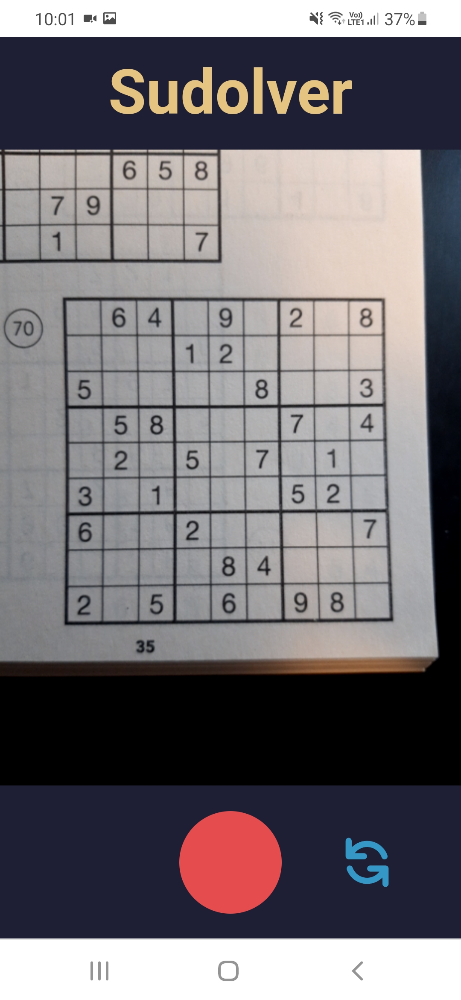
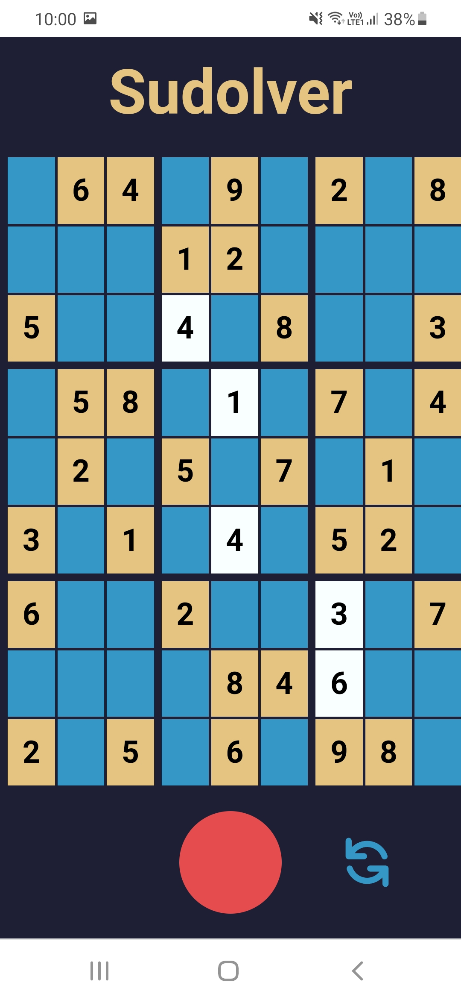

  <h1>Sudolver</h1>
  
  
Solve any sudoku faster than Lucky Luke!

> This project is still in an early alpha phase
> and you should expect breaking changes before the first stable release.

# Screenshots

  
  

# Introduction

Sudolver lets you take a picture of any sudoku and solves it for you in mere seconds.

# Documentation

The application's documentation is available under https://docs.sudolver.app.